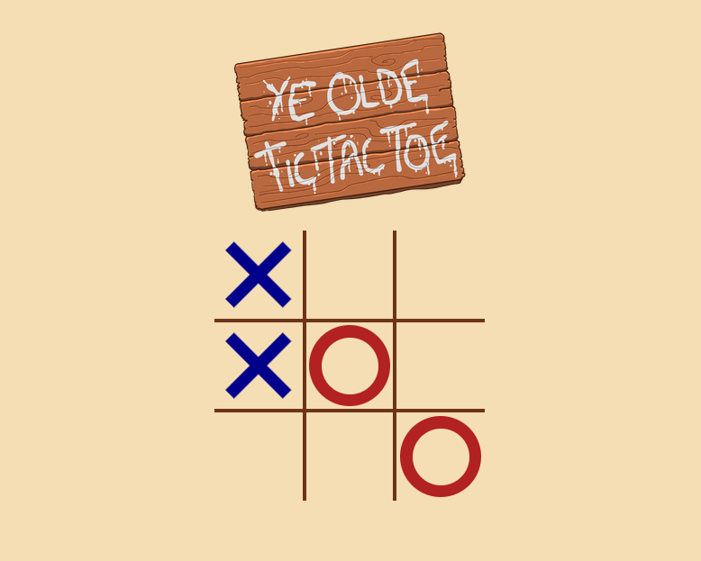
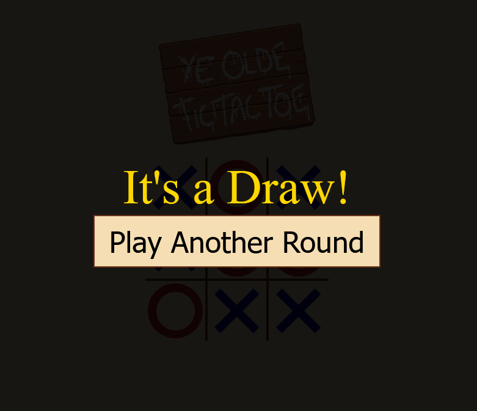
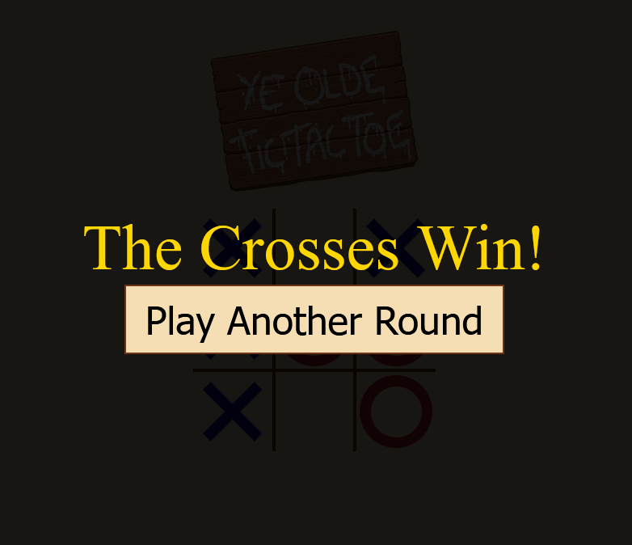
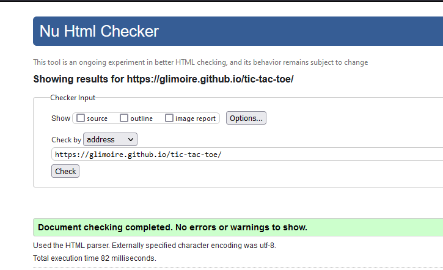
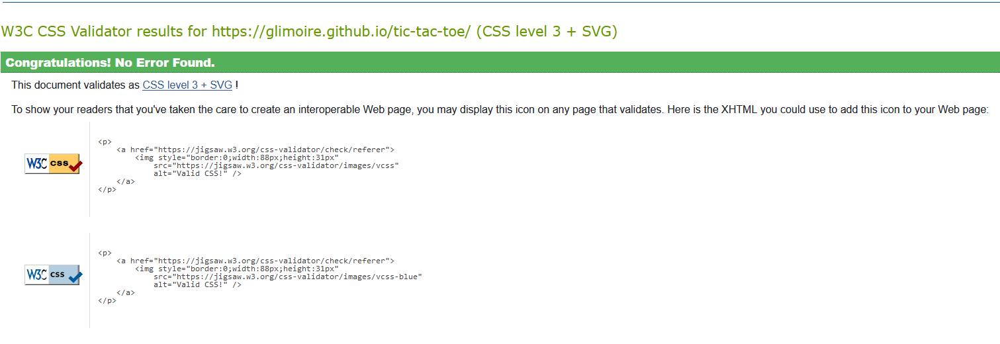
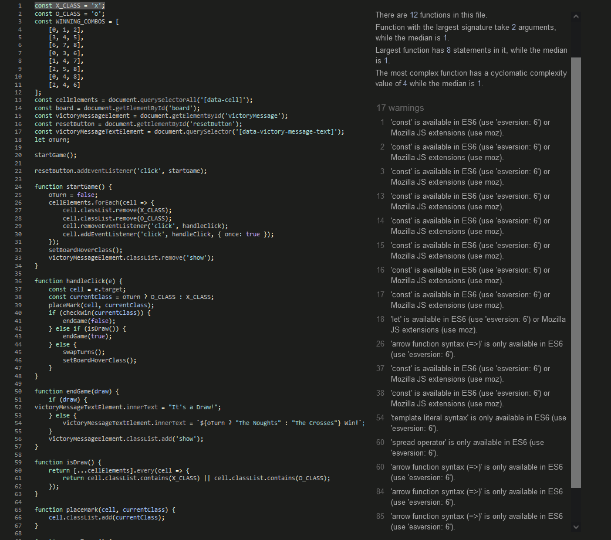
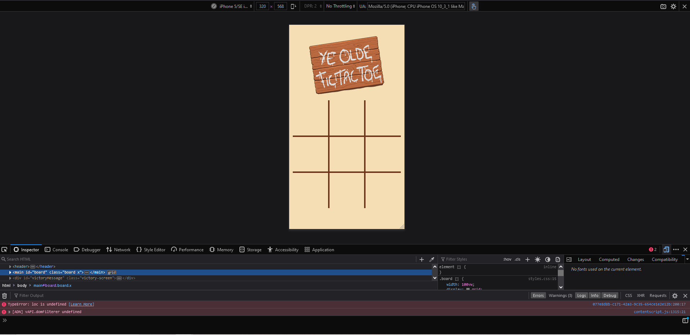
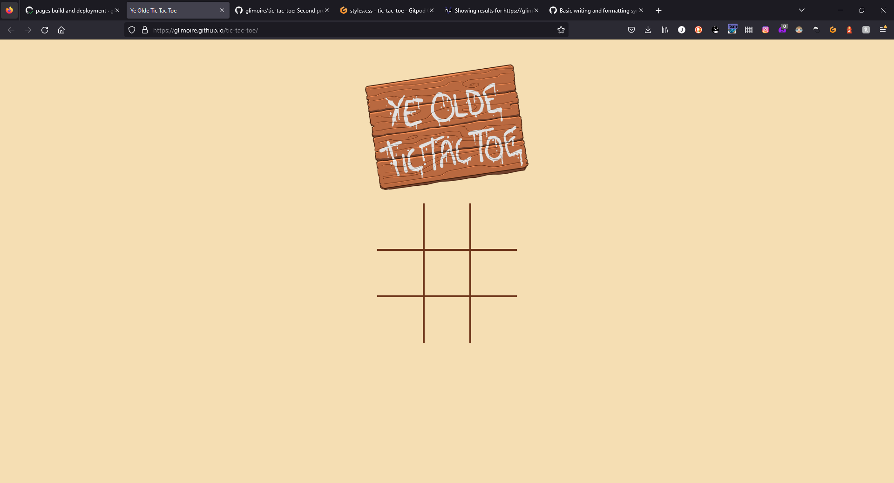
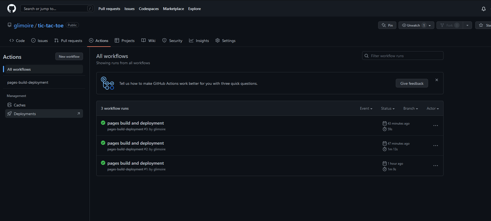

# Ye Olde Tic-Tac-Toe

## Overview

Welcome to Ye Olde Tic-Tac-Toe, a humble website harkening back to a simpler time. Built for Code Institute's Javascript project, the sandy tones and simple design will bring back fond memories of drawing symbols in the sand with your best friend Casserole Jack in the blistering heat of the Arizona Frontier, regardless of whether or not that actually happened to you.

Enjoy this game with your friends on the go, at home, or in any life-or-death situation you happen to find yourself in! Truly, Ye Olde Tic-Tac-Toe is the game of the people.

## Features
- Not one, not three, but TWO player action! Play as the callous crosses or the noble naughts!

- WIN or DRAW conditions! There is no losing when you're among friends.
- Personalized WIN screens so your opponents can't gaslight you into admitting defeat! 
- A reset button! Now you don't have to buy a new phone every time a round ends!

- Our cutting-edge anti-cheat technology stops any cheeky attempts at filling in cells with a symbol already in them!
- A full range of 6 or 7 colours, depending on how you look at it!
- A cool header image, inspired by the beautiful works of my old-fashioned neighbour Buckshot Bob!

## Testing

### Validator Evidence
Ye Olde Tic-Tac-Toe was thoroughly tested, passing checks for its HTML, CSS and Javascript codes with flying colours! Yes indeed, this pen-and-paper passtime is now at the forefront of basic programming!

### Accessibility
Afraid your phone won't be able to run our mind-boggingly advanced software? Fear no more! Ye Olde Tic-Tac-Toe can be run on any device!

## Deployment
Deploying this gift to humanity was no easy task. I was forced to navigate the treacherous Github repository settings, select the Master Branch from the Pages section and deploy it, then wait a couple of minutes for the process to complete. 

The scars left on my soul from this journey will never truly heal, but it was worth it to bring this gift of mine to you all.

## Credits
I cannot claim to have accomplished all this on my own; much of the credit goes to the fantastic Kyle no-last-name-given of [Web Dev Simplified](https://blog.webdevsimplified.com/)! His [youtube tutorial](https://youtu.be/Y-GkMjUZsmM) was fantastically helpful.

As for the header image, well, that was done by yours truly! Check out my other stuff [here](https://glimoire.uk/)!
